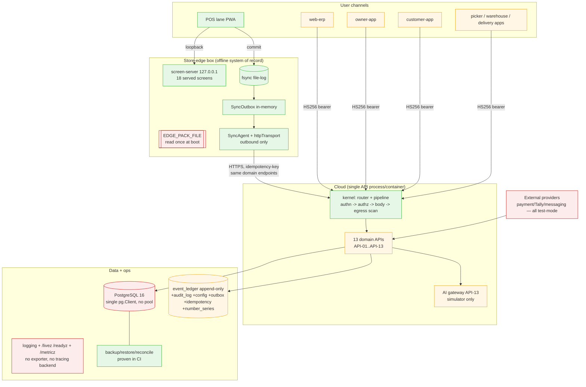

# As-Is System Architecture

_Deep architecture audit, 2026-08-09. Verified by direct inspection of code, config, migrations, CI, and tests._

## What the system is (verified)
A **modular monolith** cloud API (`services/api` assembles 13 domain APIs behind one kernel/router/pipeline into
a single process/container) plus an **offline-first store-edge box** (served screens + durable local commit +
outbound sync agent) plus **7 browser/PWA apps**. Event-sourced: append-only `event_ledger`, balances projected
by fold. Built as a pnpm/TypeScript monorepo: **17 service folders, 78 packages, 9 SQL migrations, ~332 test
files / ~4,879 tests, 31 executable guardrails, 389 commits (all via PR to a protected `main`)**.

## Current architecture (as built)

**Legend:** green = production-verified *for the pilot/CI scope*; amber = implemented, not production-verified;
red = gap / SPOF / documented-only.

## Components & ownership (verified)
- **Kernel** (`services/kernel`): router (registration-time validation — every route needs a permission, a
  version, idempotency-if-write), request pipeline (authn→authz→body, egress cross-tenant/PAN backstop),
  errors, config (boot-time refusal, exit 78), http-server (`/livez` `/readyz` `/metricz`), observability.
- **13 domain APIs** (API-01 identity/RBAC … API-13 AI): each declares routes with permissions; assembled by
  `services/api/src/main.ts` `buildSurface()`; adapters in `services/api/src/adapters.ts` bind ports to the SQL
  event store (or stubs when `store===undefined`).
- **78 packages**: the pure, unit-tested domain/engine core (ledger, stock/valuation/ageing/metrics, rbac,
  audit, ai authority/gateway/safety/evaluation/budget, integration ports, sync outbox, numbering, period-close/
  tally, reconciliation, settlement, notifications, export, ops backup/health/logging, contracts/money/event).
- **Store-edge** (`edge/store-edge`): StorePack (`Register<T>` known/notKnown), screen-data payload builders (18
  screens), loopback screen-server, durable file-log + PosSession commit path.
- **Sync-agent** (`edge/sync-agent`): outbound drain + real HTTP transport routing to domain endpoints.
- **Apps** (7 PWAs): pos, web-erp, owner-app, customer-app, picker-app, delivery-app, warehouse-app — served
  offline shells with service workers.

## Data stores (verified — only 7 physical tables exist)
`event_ledger` (append-only, guarded) · `audit_log` (append-only, guarded, no hash-chain columns) ·
`config_versions` (append-only, guarded) · `sync_outbox` (mutable by design) · `idempotency_keys` (cache;
**not** trigger-guarded) · `number_series` (mutable counter; `(tenant,doc_type)` only) · `schema_migrations`.
The rich `db/data-dictionary/` entity model (Tenant/Company/Branch/User/Role/Device/…) is **logical only — no
DDL** (`db/data-dictionary/README.md:8`).

## Trust boundaries
Tenant↔tenant (signed claim + egress 500 backstop; **no RLS**) · client↔cloud (stateless HS256 bearer) ·
human↔system (default-deny RBAC + maker-checker + time-boxed support) · AI↔domains (closed forbidden-tool list,
admission-before-transport, no DB write) · system↔providers (HMAC webhooks, `vault://` refs) · edge↔cloud
(signed packs; outbound sync). See SECURITY_PRIVACY_THREAT_MODEL.md.

## Main data flows
1. **Sale (offline):** lane → loopback → PosSession decide → **fsync** → ledger → outbox → receipt; SyncAgent
   drains → `/v1/sales` → cloud ledger (dedup on `tenant+idempotencyKey`). *Production-verified (integration).*
2. **Screen render:** pack (local file) → payload builder (returns null / "not known" when a section is absent)
   → served screen. *Production-verified.*
3. **Write request (cloud):** authn → authz (RBAC rebuilt from ledger) → idempotency → handler appends events
   → egress scan → audit. *Implemented.*
4. **AI:** run → kill-switch/enabled/budget admission → simulator → proposals with evidence → human commits via
   ordinary domain endpoint. *Implemented (simulator only).*

## Failure-sensitive dependencies & single points of failure (verified)
1. **Single PostgreSQL, no replication/HA** (compose `postgres:16`).
2. **Single API process** — all 13 APIs in one container; **production shares one `pg.Client` (not a Pool)**
   across every store — a serialization bottleneck and a hard SPOF (`services/api/src/main.ts:323`).
3. **Single store-edge box + single disk** holds a store's unsynced sales (mitigated: "money safe on disk",
   safe-stop when full).
4. **Branch-protection is one manual GitHub toggle**; only the `verify` CI job is a *required* check.
5. **nginx ingress terminates no TLS**; secrets are `.env`-only (no KMS/vault); metrics have no exporter and
   alerts reach no channel.
6. **Inbound sync is a locally-placed file** — no live refresh path.

## Capability status map (headline; full detail in GAP_REGISTER_AND_RISK_REGISTER.md)

| Domain | Status | One-line evidence |
|---|---|---|
| Offline POS sale path (commit-local-first, exactly-once sync) | **Production-verified (pilot/CI)** | rings sale cable-out → real cloud ledger |
| Event store / append-only ledger / dedup / number-series | **IV → PV at contract level** | contract-tested both impls; DB guards conditional on `DATABASE_URL` |
| RBAC / authn / tenant egress backstop / maker-checker | **Implemented, not prod-verified** | strong code, no pentest |
| Backup → restore → reconcile (QG-08) | **Production-verified (CI)** | real dump/drop/restore each run |
| CI correctness controls (secret-scan, config-refusal, migrate-idempotency, container refuse/drain) | **Production-verified (CI)** | `ci.yml` 3 jobs |
| Domain analytics (stock valuation/ageing/turns/GMROI/returns) & most modules | **Implemented, not prod-verified** | wired + integration-tested in-memory/local PG |
| AI governance (kill-switch/budget/authority/evaluation) | **Implemented (simulator only)** | `run()` returns `[]`; no live model |
| Integrations (payment/Tally/messaging/webhooks/devices) | **Implemented (test-mode)** | ports & adapters; no live vendor |
| Inbound sync / offline numbering wired / conflict UI / DSR API / hash-chain wired | **Documented-only / not-wired** | engines exist; wiring absent |
| Cloud hosting / IaC / CD / HA / TLS / observability delivery | **Planned-only / Missing** | CI-only; ADR-0002 hosting still *Proposed* |

## The single most important framing for scoring
Almost the entire system is **Implemented-but-not-production-verified**: proven against in-memory/local
Postgres, test-mode providers, and a local IdP, inside CI — never against real users, real data volume, real
providers, or a deployed environment. The engineering *discipline* (executable guardrails, DR-in-CI, honest
"not known" surfaces, ledger correctness) is genuinely top-tier; the **operational and integration reality** is
pre-pilot.
