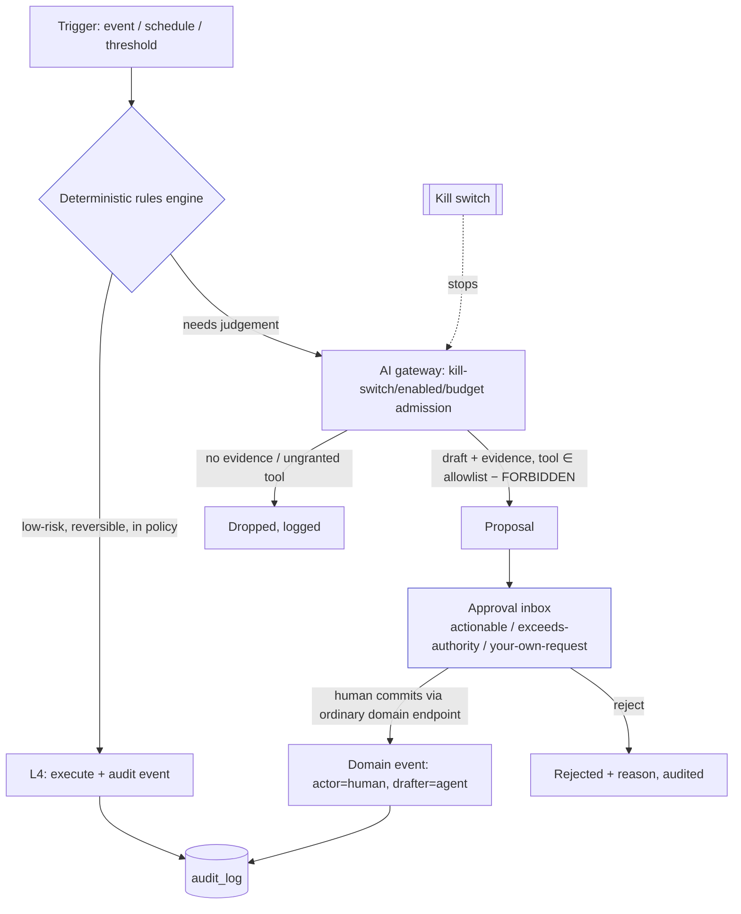

# Autonomous Product Blueprint

_Deep architecture audit, 2026-08-09. "Autonomous" here means **safe, governed business automation** — not
uncontrolled AI. The good news, verified: the hardest and rarest part — the **governance skeleton** — already
exists and is wired (`packages/ai/src/authority.ts`, kill-switch/budget/evaluation, `FORBIDDEN_TOOLS`,
drafter/actor separation). Most of the highest-value automations need **wiring, not new engines.**_

## Governing principles (from the codebase, preserved)
- **P-05 / Hard Rule #5:** AI recommends or drafts; deterministic rules + authorized humans commit critical
  actions. An AI agent never writes the DB and never commits a price, payment, refund, purchase, stock, or
  privilege change. This is enforced structurally (closed `FORBIDDEN_TOOLS`, no commit route, gateway drops
  ungranted tools) and must remain so.
- **Everything is reversible and audited.** Every automated action is an append-only event with the agent as
  *drafter* and a named human as *actor* for anything committing.
- **Kill switch first.** Production AI defaults kill-switch **on** (`services/api/src/main.ts:302-308`).

## Autonomy levels (applied to this product)
| Level | Meaning | Where it may apply here |
|---|---|---|
| **L0 Manual** | Human does it all | Legacy/edge cases |
| **L1 Assisted** | System surfaces data/context | Exception dashboards, drill-through KPIs (largely exists) |
| **L2 Recommended action** | System drafts a specific action + evidence; human decides | Reorder POs, markdown/transfer suggestions, investigation prioritisation |
| **L3 Approval-gated execution** | System prepares an action that executes **only** on human approval via the inbox | Auto-generated PO sent on buyer approval; markdown applied on manager approval |
| **L4 Policy-controlled autonomous** | Deterministic **rules** (not AI) execute low-risk, reversible actions within a policy envelope, fully audited, with easy reversal | Notification sends within consent+budget; re-sync retries; low-value non-financial housekeeping |
| **L5 Fully autonomous** | No human in the loop | **Prohibited** for anything financial/legal/safety/irreversible |

**Hard rule for this product:** **never L5** for payment, refund, pricing, purchase commit, stock adjustment,
payroll, credit-block, period close, privilege change, or any irreversible/compliance decision. L4 is reserved
for **deterministic-rule** actions that are low-risk and reversible — the AI never reaches L4 on its own.

## Decision & approval flow (target)

`← new`: the **deterministic rules/workflow engine** (ADR-A12) and the **unified approval inbox** (wire
`packages/owner-control` alerts-inbox + `packages/approvals`) are the two pieces to build/wire. Everything else
exists.

## Per-workflow recommended safe autonomy level (evidence-based)
Each below lists the **max safe level**, the trigger, the data (which already exists), the deterministic-vs-AI
split, approval level, reversibility, and the wire needed.

| Workflow | Max safe level | Data exists | Det. rules vs AI | Approval | Reversible? | Wire needed |
|---|---|---|---|---|---|---|
| **Reorder PO drafting** | **L2→L3** | replenishment engine + inventory position + supplier perf | Rules compute reorder point/qty; AI drafts supplier/notes | Buyer commits (§28) | Yes (draft) | Wire A02 + replenishment → approval inbox. **Highest ROI, lowest risk.** |
| **Owner exception-alert feed** | **L2** | `owner-control/alerts-inbox` (grouped, thresholded: large_discount, voided_bill, price_override, after_hours_login, cash_short) | Deterministic thresholds; no AI needed | Owner reviews | N/A (read) | **Pure wiring** — engine exists, unwired |
| **Expiry / markdown / transfer suggestions** | **L2→L3** | fefo/expiry + stock position | Rules for expiry windows; AI ranks markdown | Manager commits | Yes | Wire A03 + fefo → inbox |
| **Duplicate/anomaly (loss-prevention) flagging** | **L2** | loss-prevention (duplicate-bank already wired M15-FR-03) | Rules detect; AI prioritises narrative | Human investigates/sanctions | N/A (flag) | Wire A07/A08 feed |
| **Settlement / 3-way-match exception routing** | **L2→L3** | settlement + purchase auto-withhold | Deterministic tolerance; route exceptions | Accountant/owner | Yes (withhold) | Route to inbox |
| **Blind-count variance → compensating adjustment** | **L3** | warehouse/counts valued variance | Rules compute variance; require §28 approver | Second person | Yes (compensating) | Wire to inbox |
| **Notification sends (consent+budget)** | **L4** | notifications guard/queue (consent, budget, suppression) | **Deterministic only** — no AI commit | Policy envelope | Yes (suppress) | Already engine-complete; wire feed |
| **Re-sync retries / dead-letter re-attempt** | **L4** | sync agent | Deterministic backoff | Policy | Yes | Add operator resolve UI |
| **Price change** | **L2 max** | pricing engine | AI may *draft* a proposal only | Owner/manager approve+commit | — | Never above L2 for AI |
| **Payment / refund / period close / privilege** | **L0–L1 only for AI** | — | AI never proposes a commit tool (`FORBIDDEN_TOOLS`) | Human only | — | **Never automated** |

## What the product needs (verified: exists / wire / build)
| Component | Status | Action |
|---|---|---|
| Deterministic workflow/rules engine | **Missing** (per-domain state machines only) | **Build** small rules engine (ADR-A12) |
| Approval inbox | **Engine exists, unwired** (`owner-control/alerts-inbox`, `packages/approvals`) | **Wire** into owner/erp surfaces |
| Event bus | In-process events + outbox | Keep; add transaction boundaries |
| AI orchestration layer | **Wired (simulator)** | Add live provider behind ports |
| Policy engine | Partial (RBAC + entitlements + forbidden-tools) | Extend with action-policy envelopes |
| Knowledge / RAG layer | **Missing** | Build **only if** a real retrieval need is proven (not before) |
| Tool registry | **Exists** (per-agent allowlist ∩ entitlement − forbidden) | Keep |
| Agent identity & permission scopes | **Exists** (A01–A10, approver roles) | Keep |
| Model gateway & fallback | **Exists (simulator), provider-neutral** | Add live adapter + fallback tier |
| Evaluation framework | **Exists (engine)** | Wire into CI as a release gate |
| AI audit log | **Partial** (events in tests, no route) | **Build** first-class AI audit route/query |
| Cost / token controls | **Exists (engine)** | Wire real metering when provider added |
| Prompt / model versioning | **Missing** | **Build** a prompt/model version registry |
| Tenant-controlled AI enablement | **Exists** (entitlements + enabled-agents) | Keep |
| Emergency kill switch | **Exists, default-on** | Keep |

## Sequencing (autonomy is the *last* build phase, gated behind foundations)
Do **not** enable any autonomy until: data-integrity foundations (transactions, RLS, audit hash-chain) and the
deterministic rules engine + approval inbox are in place, AND a controlled pilot is running. Then:
1. **L1/L2 first** — wire the exception-alert feed and reorder/markdown *drafts* (read + draft only). No risk.
2. **L3** — approval-gated execution through the inbox for reorder POs, markdowns, variance adjustments.
3. **L4** — deterministic-rule-only, reversible housekeeping (notifications within consent+budget, re-sync).
4. **Live AI** behind the governed ports only after the evaluation framework runs as a CI gate and a red-team
   battery + AI audit route exist. Never L5 on the prohibited list.

The governance is the moat: this product can offer *safe* automation precisely because the "AI cannot commit"
guarantee is structural and tested. The build task is to **wire the value on top of the guardrails that already
hold.**
