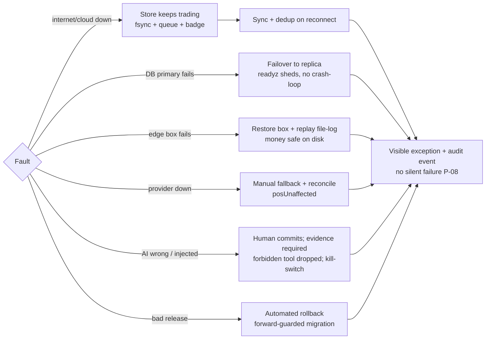

# Executive Architecture Audit

_SRE Retail OS — deep, evidence-based architecture & product audit. 2026-08-09. Auditor roles: Principal
Architect, Enterprise Product Strategist, AI/Security/Data/DevOps-SRE architects, Offline-First expert, UI/UX
reviewer. Method: seven parallel read-only evidence sweeps of code/config/migrations/CI/tests + authoritative
external benchmarking. Companion documents in `docs/audit/`._

## 1. Executive verdict (plain business language)
You have built something rare and genuinely impressive: a **correctness-first retail operating system** whose
rules are enforced by the software itself, whose till keeps trading with the internet unplugged, and whose own
paperwork honestly tells you what is and isn't finished. The **engineering discipline is world-class** — better
than most funded products — and the **offline sale path is real and proven**.

But it is **not yet a product you can switch on for a real shop.** Almost everything is proven in a test harness,
not in the real world: there is **no live cloud deployment, no real payment or accounting connection, no live
staff logins, and nothing has been through a real store day.** The clever domain "engines" are largely **not yet
connected to the running services** — six of seven services are thin re-implementations, and about half the
engine library runs only in its own tests. The pieces that make a system *operable* — hosting, monitoring that
actually alerts someone, encryption in transit, rate-limiting, automated rollback, and privacy-erasure controls
— are **designed on paper but not built**.

In short: **a superb core, an unbuilt operational half.** The path to a 10/10 product is clear and mostly about
*wiring and hardening what exists*, plus standing up real infrastructure — not a rebuild.

## 2. Current overall score: **5.5 / 10**
- As a **domain / correctness core**: ~8.5/10 (rare quality).
- As a **deployed, production-grade hybrid product**: ~2.5/10 (pre-pilot; 0% production-verified).
- Blended: **5.5/10.** Full 20-dimension scorecard in GAP_REGISTER_AND_RISK_REGISTER.md. It is **not** 10/10 and
  cannot be until real deployment, real providers, and independent verification exist.

## 3. Readiness gates
| Ready for… | Verdict | Why |
|---|---|---|
| **Development continuation** | ✅ **Yes** | Exceptional foundation, honest traceability, executable guardrails; the roadmap is clear. |
| **Controlled pilot** | ⚠️ **Not yet** — after Phases 0–5 (est. ~2–4 focused months) | Needs hosting, TLS, observability delivery, rate-limiting, offline numbering, inbound sync, and finance/reporting wired. |
| **Production** | ❌ **No** | 0% production-verified; no deployed environment; test-mode providers; QG-06 pentest unmet. |
| **Unsupervised public launch** | ❌ **No** | Requires pilot + pentest + real providers + SLOs held + DR drill. |

## 4. Five strongest areas (verified)
1. **Offline-first trading** — POS commits to fsync'd disk before the receipt, queues durably, reaches a real
   cloud ledger exactly once, dead-letters visibly; integration-tested with the cable out. (Best-proven part.)
2. **Executable guardrails (31)** — each Hard Rule is a CI tripwire with a proven tripwire; the safety spec is
   *alive*, not a document. Rare.
3. **Correctness controls actually executed in CI** — secret-scan, boot-config refusal (exit 78),
   migrate-idempotency, and a real **backup→drop→restore→reconcile-to-the-paisa** on every run.
4. **Honest, machine-checked self-assessment** — traceability & completion-ladder guardrails make the project
   unable to lie about its own status. This audit largely *confirms* the repo's own honesty.
5. **Governed-AI skeleton** — closed `FORBIDDEN_TOOLS`, admission-before-transport, drafter/actor separation,
   provider-neutral: the AI *structurally cannot* commit money or write the DB. A genuine safety moat.

## 5. Ten most serious verified gaps
1. **Nothing is production-verified** (0%); ~25% wired, ~8% integration-tested (GAP-ARCH/RTM).
2. **Thin-service drift** — 6/7 services re-implement instead of importing the tested engines; 35/77 packages
   run only in tests (GAP-ARCH-01).
3. **No transaction boundaries** — multi-event commands are not atomic (GAP-DATA-01).
4. **Single shared `pg.Client`** (not a pool) across all stores — SPOF + bottleneck (GAP-DATA-09).
5. **Tenant isolation is application-level only** — no RLS, no `tenants` FK (GAP-DATA-02).
6. **DPDP data-subject rights & erasure not wired** — engine exists, no API, no erasure vs the append-only store
   (GAP-SEC-02 / DATA-06).
7. **Audit hash-chain non-cryptographic & unwired**; no rate limiting; no token revocation (GAP-SEC-03/04/05).
8. **No inbound sync & offline numbering unwired** — prices/recalls arrive by manual file drop; receipt numbers
   can collide across offline lanes (GAP-SYNC-01/02).
9. **Observability computes health but delivers it nowhere**; no hosting/IaC/CD/automated rollback; TLS/secret-
   store absent in-repo (GAP-OPS-01/02/03).
10. **0 e2e/browser tests; no load/chaos/tenant-isolation/vendor-contract tests; AI never run against a real
    model** (GAP-TEST-01 / AI-01).

## 6. Recommended target architecture (one line)
Keep the **modular monolith + offline-first edge**; evolve, don't rebuild. Add: pg.Pool + transactions + RLS +
snapshots; inbound signed-pack sync; a rules engine + approval inbox; a live AI model behind the existing
governed ports; observability delivery + hosting/IaC/CD/TLS/secret-store; SHA-256 audit chain + DSR API.
**Avoid** CRDTs, Kafka, Kubernetes, microservices, vector DBs, multi-agent swarms — none is justified at
one-store scale (research-backed). Full design in TARGET_HYBRID_ARCHITECTURE.md.

## 7. Recommended safe autonomy level by major workflow
| Workflow | Max safe level | Note |
|---|---|---|
| Reorder-PO drafting; markdown/transfer/expiry suggestions; exception & anomaly alerts | **L2 → L3** | AI drafts, human commits via inbox |
| Notifications (consent+budget); re-sync retries; low-risk reversible housekeeping | **L4** | **Deterministic rules only**, not AI |
| Price change (AI involvement) | **L2 max** | AI may draft; human commits |
| Payment, refund, purchase commit, stock adjustment, period close, privilege, payroll, credit-block | **Never automated (AI L0/L1)** | `FORBIDDEN_TOOLS`; human-only, forever |

Full mapping in AUTONOMOUS_PRODUCT_BLUEPRINT.md.

## 8. Exact next implementation sequence (single active track)
`STAB-01 pg.Pool → STAB-02 offline numbering → STAB-03 wire owner alert-inbox → G0 → FND-01 transactions /
FND-02 SHA-256 audit / FND-03 rate-limiting → G1 → SYNC-01 inbound sync / SYNC-06 offline-boot e2e → G2 →
CORE-01 collapse thin services / CORE-02 finance+reporting → G3 → INT-01 real PSP + IdP / INT-04 contract tests
→ G4 → OPS-01 hosting+IaC+CD / OPS-02 observability / OPS-03 TLS+secrets → G5 → AUTO-01 rules+inbox / AUTO-02 L2
drafts → PILOT-01 → LAUNCH-01 pentest / LAUNCH-02 providers → LAUNCH-03.` One phase at a time; each gate green
before the next.

## 9. Owner decisions genuinely required (unavoidable business decisions only)
| ID | Decision | Why it's unavoidable | Blocks | Recommended |
|---|---|---|---|---|
| **OA-5 / OB-02** | **Choose cloud hosting** (managed Postgres w/ HA + container host + secret store + region) | Cannot build IaC/CD/TLS/observability/DR without a target; ADR-0002 is still *Proposed* | All of Phase 5 → pilot/production | Pick an India-region managed provider; approve a modest budget |
| **OA-4** | **Choose payment/UPI provider + production IdP** | Real money & real staff logins need chosen providers + keys | Phase 4 + launch (pilot runs test-mode) | Keep test-mode for pilot; choose before real money |
| **OA-10** | **Native-Tamil review of on-screen wording** | Guardrails prove completeness, not correctness of translation | PILOT-02 (not trading-blocking) | A Tamil-speaking staff member reviews before go-live |
| **OA-12** | **Subscription plans/pricing** (only if selling to other retailers) | Commercial model can't be invented | Only multi-tenant commercialisation | Defer; single-tenant needs none |
| **OWN-NEW-1** | **Confirm privacy/retention policy** (erasure vs GST/IT/Companies-Act retention) for the DSR build | Legal retention windows are a business/accountant call | FND-05 (DSR) | Confirm with your accountant; the engine already models "retain vs erase" |

Everything else in this audit is an engineering decision the team should make and has been recommended herein —
no further owner input required to proceed through Phases 0–3.

## 10. Failure & recovery posture (target)

Items in this diagram that **already work**: internet-down trading + sync, edge replay, provider manual
fallback, AI containment. Items that are **build targets**: DB replica/failover, automated rollback, and turning
"visible exception" into a delivered alert (observability).

## 11. Bottom line for the owner
Keep going — the foundation is worth building on and the discipline is exceptional. The next ~2–4 months of
focused work should be about **connecting the engines to the services, standing up real hosting with monitoring
and encryption, and wiring the safe automations that already exist** — then a **controlled pilot in your own
store on test-mode payments**, then a **security pentest** before real money and public launch. Do not let the
"97% built" headline suggest it's nearly done: the honest, verified number for *a system you can switch on* is
about **a quarter wired and none yet proven in the real world** — and that is exactly the half the roadmap above
builds.
