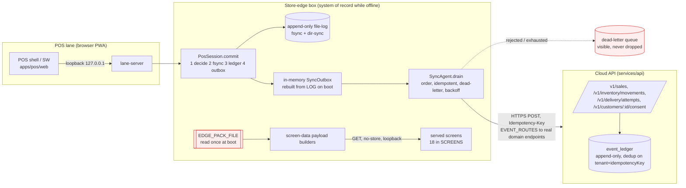

# Offline, Sync & Conflict Strategy

_Deep architecture audit, 2026-08-09. Verified against `edge/store-edge`, `edge/sync-agent`, `packages/sync`,
`packages/numbering`, the PWAs, the offline guardrails, and the two real-PostgreSQL integration suites._

## Verdict in one paragraph
The **offline-first trading** claim (P-01, Hard Rule #1) is **real, wired, and integration-tested**: a POS sale
is decided, written to fsync'd local disk **before** the receipt prints, queued in a durable outbox, and
delivered to a real cloud ledger **exactly once** on reconnect, with honest dead-letter and a live unsent-count
badge. This is a genuinely strong offline posture and the best-proven part of the whole system. The weaknesses
are all on the **inbound/refresh** side and in **operational depth**: there is **no live inbound sync** (price/
catalogue/recall packs arrive only as a locally-placed file), **offline document numbering is not wired to the
till**, structured **conflict resolution is a dead-letter string** rather than the two-sided object the design
describes, and there is **no clock-drift/causality handling** and **no operator dead-letter UI**.

## As-built sync topology (verified)

**Legend:** the red `EDGE_PACK_FILE` is the biggest gap — nothing in the codebase *fetches or polls* it; how it
lands on the box is out of scope of the code. The dead-letter queue is real and visible but has **no operator
resolution screen**.

## Capability status (verified, with evidence)

| Capability | Status | Evidence |
|---|---|---|
| POS commits locally first, fsync before receipt | **Production-verified** (integration) | `apps/pos/src/session.ts:319-398`; sale rung with cable out `tests/integration/offline-sync-slice.test.ts:168-198` |
| Durable local outbox (file-log + rebuild, cursor over contiguous prefix) | **Production-verified** | `packages/.../file-log.ts:73-108`, `edge/store-edge/src/sync-cursor.ts:56-68` |
| Store-and-forward drain: order, idempotent, dead-letter, backoff, stop-early | **Production-verified** | `edge/sync-agent/src/agent.ts:99-171`, `:68-74`, `:136-159` |
| Idempotent exactly-once delivery (key minted at lane, cloud dedupes, 409→accepted) | **Production-verified** | `http-transport.ts:83,126-129`; `the-shop-reaches-the-cloud.test.ts:171-194` |
| Each event routed through the SAME validated domain endpoint (no bypass ingest) | **Production-verified** | `http-transport.ts` `EVENT_ROUTES`; comment `:1-20` |
| Served screens honour "not known ≠ empty" (Register<T> known/notKnown) | **Production-verified** | `store-pack.ts:31-46,802-975`; guardrail `the-box-never-invents-an-answer.test.ts` |
| Service workers: registered, network-first, versioned cache, bilingual stale strip | **Implemented (static-analysis only)** | guardrail `every-screen-opens-without-a-network.test.ts:55-205` (admits it cannot prove a live dead-router boot) |
| Sync observability (unsent/dead-letter/last-success; POS badge; manager surface) | **Production-verified** | `agent.ts:84-91`, `durability.ts:196-228`, `screen-data.ts:169-227` |
| Max offline duration bounded by disk, safe-stop (refuse sale) not data-loss when full | **Implemented** | `durability.ts:50-174` |
| **Inbound sync (cloud→edge packs: price/catalogue/recall/approvals)** | **Documented-only / Missing** | edge reads `EDGE_PACK_FILE` once at boot `main.ts:190-204`; nothing polls/fetches; `offline-sync.md:30-31,46` not implemented |
| **Offline document numbering (reserved ranges) wired to POS** | **Implemented-but-not-wired** | engine `packages/numbering/src/numbering.ts:57-100` unit-tested; till mints `R-${timestamp}` `apps/pos/web/app.js:450`; allocator absent in `bootPos` |
| **Structured two-sided conflict object + role-routed resolution UI** | **Partially / Documented-only** | conflicts collapse to dead-letter string `agent.ts:136-142`; no `conflict.ts`; `offline-sync.md:46-53` unimplemented |
| Operator "work the dead-letter queue" UI (retry/resolve) | **Missing** | dead-letters exposed as data `outbox.ts:101-104`, no interactive screen |
| Clock-drift / causality / vector clocks | **Missing (by design local clock)** | `main.ts:209,313`; FIFO + arrival-seq only; trading-day cutoff defaults midnight `main.ts:63-65` |
| Tombstone / delete propagation | **Missing** | grep `tombstone` = 0 code hits; log append-only |
| Handheld/vehicle durability (COD/scans) | **Implemented, weaker than lane** | `device-outbox.ts:14-26` localStorage, "survives app close, not power loss" |
| SqlOutboxStore (durable DB outbox) wired to edge | **Implemented-but-not-the-edge-path** | `packages/persistence/src/outbox-store.ts:144-223` exists; edge uses in-memory+file-log |

## Failure-mode analysis (evidence-based)

| Scenario | Current behaviour (verified) | Residual gap |
|---|---|---|
| Internet down all day | Lane keeps selling; sales fsync'd + queued; badge shows unsent; drains on reconnect | Inbound refresh (prices/recalls) frozen at last pack-file drop |
| Cloud down, store trades | Same as above — edge is system of record | Non-sale events (InventoryMoved etc.) can dead-letter with no operator queue |
| Edge box/disk fails | Money is safe *if disk survived*; single box + single disk is the SPOF | No edge replication; recovery = restore box + replay file-log |
| Sync stops midway | Cursor advances only over contiguous finished prefix; nothing skipped | — (well handled) |
| Duplicate transaction arrives | Cloud dedupes on `(tenant, idempotencyKey)`; 409→accepted | — (well handled) |
| Same record edited edge+cloud | Cloud rejection → dead-letter with reason (edge wins for sales it took) | No two-sided conflict object; resolution is manual/runbook |
| Out-of-order arrival | Cloud stores by arrival seq; event keeps `occurredAt` | No causal reordering engine |
| Device clock wrong | Local clock used deliberately; trading-day may mislabel | No NTP/skew detection |
| Two lanes offline, both number receipts | Both mint `R-${timestamp}` | **Collision risk** — reserved-range allocator not wired (QG-04 not demonstrated end-to-end) |

## Recommended strategy (target)
Ordered by priority; full roadmap IDs in DEPENDENCY_AWARE_IMPLEMENTATION_ROADMAP.md.

1. **[REC] Wire offline document numbering into the POS (SYNC-01, P0).** Replace `R-${timestamp}` with the
   existing `ReservedRangeAllocator`; provision each lane a reserved range in its pack; prove "two lanes a day
   offline → no duplicate numbers" as an integration test (closes QG-04). *This is the highest-value fix — it is
   an already-built engine one wire away from removing a real money-document collision.*
2. **[REC] Implement a real inbound pack-sync path (SYNC-02, P0).** A pull/poll (or push-with-ack) that fetches
   the signed pack (price/catalogue/recall/entitlement) from the cloud on a cadence and atomically swaps the
   local file; surface "pack age" on every screen (the honesty machinery already exists). Until this exists the
   "one commerce truth" (P-02) and offline recall-block are only as fresh as a manual file drop.
3. **[REC] Structured conflict object + operator dead-letter/reconciliation screen (SYNC-03, P1).** Turn the
   dead-letter string into `{ ours, theirs, reason, suggestedAction, role }` and give the manager screen a
   queue to retry/resolve — realizing `offline-sync.md:46-53`.
4. **[REC] Keep LWW-with-visible-conflict; do NOT adopt CRDTs/vector clocks (SYNC-NONGOAL).** Per-record single
   ownership makes them unjustified overhead (see RESEARCH_SOURCES_AND_BENCHMARKS §1/§3).
5. **[REC] Clock-drift *detection* (not correction) (SYNC-04, P2).** On sync, compare edge `occurredAt` to
   server receive-time; flag a box whose skew exceeds a threshold as a visible exception so a mislabeled
   trading-day is caught, without changing the deliberate local-clock design.
6. **[REC] Harden handheld durability (SYNC-05, P2).** For COD/scan queues, add an fsync-backed path where the
   platform allows, or at minimum a "n unsent, last saved at" badge and a periodic server checkpoint, given the
   acknowledged localStorage loss surface.
7. **[REC] Add a headless-offline boot e2e (SYNC-06, P1).** The guardrails prove the *decisions* survive; a
   Playwright test (Chromium is available) should prove a screen actually opens with the network cut — the one
   thing the static guardrails admit they cannot.
