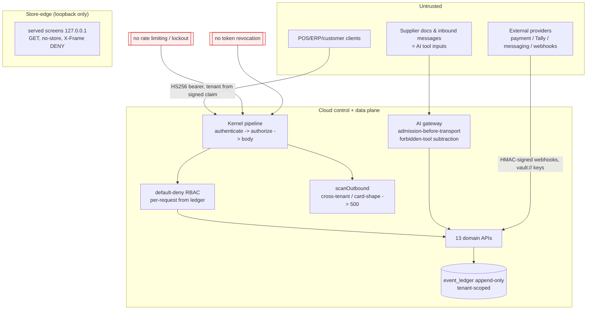

# Security & Privacy Threat Model

_Deep architecture audit, 2026-08-09. Verified against `services/identity`, `services/kernel`, `services/api`
(roles/access/pipeline), `packages/rbac`, `packages/ai`, `packages/audit`, `packages/customer`,
`db/migrations`, and the security/guardrail suites. Complements the project's own
`docs/security/threat-privacy-model.md`, which this audit finds **broadly sound but overstated in two places**
(DSR self-service; rate limiting)._

## Overall posture
The **code-level** security design is strong and, in several places, better than typical for a product at this
stage: a hardened JWT verifier, registration-time route validation forcing a permission on every endpoint,
default-deny RBAC rebuilt per request from the ledger, maker-checker that blocks approver-privilege-escalation,
a cross-tenant/PAN **egress backstop that 500s rather than redacts**, boot-time refusal of placeholder/short
secrets, closed AI forbidden-tool list, and a comprehensive guardrail suite encoding each Hard Rule as a CI
tripwire. **However, nothing is production-verified** (the system is pre-pilot; QG-06 — zero critical/high plus
an independent pentest — is a documented gate not yet met), and there are **five real, verified control gaps**
(DSR-not-on-API, audit hash-chain not cryptographically wired, no rate limiting, no token revocation,
support-expiry not enforced at the API tier).

## Trust boundaries (as-built)

```mermaid
flowchart TB
  subgraph Untrusted["Untrusted"]
    C[POS/ERP/customer clients]
    EXT[External providers\npayment / Tally / messaging / webhooks]
    SUP[Supplier docs & inbound messages\n= AI tool inputs]
  end
  subgraph Edge["Store-edge (loopback only)"]
    SE[served screens 127.0.0.1\nGET, no-store, X-Frame DENY]
  end
  subgraph Cloud["Cloud control + data plane"]
    K[Kernel pipeline\nauthenticate -> authorize -> body]
    K --> RBAC[default-deny RBAC\nper-request from ledger]
    RBAC --> DOM[13 domain APIs]
    DOM --> DB[(event_ledger append-only\ntenant-scoped)]
    K --> EG[scanOutbound\ncross-tenant / card-shape -> 500]
    AIG[AI gateway\nadmission-before-transport\nforbidden-tool subtraction] --> DOM
    SUP --> AIG
  end
  C -->|HS256 bearer, tenant from signed claim| K
  EXT -->|HMAC-signed webhooks, vault:// keys| DOM
  classDef gap fill:#fee,stroke:#c00;
  RL[[no rate limiting / lockout]]:::gap --> K
  REV[[no token revocation]]:::gap --> K
```

## STRIDE-style summary (verified controls vs. gaps)

| Threat | Control in place (evidence) | Status | Gap |
|---|---|---|---|
| **Spoofing** (forged token, alg-confusion) | Verifier pins HS256, verifies signature before claims, timing-safe compare, `exp/iss/aud` required (`services/identity/src/token.ts:106-190`) | Implemented (strong) | ~~No token revocation/denylist~~ **CLOSED (29 Sep 2026)** — lifetime ceiling (`IDP_MAX_TOKEN_LIFETIME_SECONDS`, default 31 days) + append-only revocation list by `jti` or by user-issued-before, consulted on every request (`services/identity/src/revocation.ts`; `tests/integration/token-revocation.test.ts`). Residual GAP-SEC-05b: cross-instance propagation ≤60s |
| **Tampering** (edit ledger/audit) | DB triggers refuse UPDATE/DELETE on `event_ledger`/`config_versions`/`audit_log` (`0004`,`0008`); code guardrail `ledger-append-only` | Implemented (strong) | ~~Hash-chain not crypto / not wired~~ **CLOSED (FND-02; corrected 29 Sep 2026)** — every `audit_log` row is SHA-256-sealed onto its predecessor per tenant (`services/kernel/src/audit-chain.ts`, migration `0010`, `SqlAuditSink` in `main.ts`), `verifyAuditChain` names the breaking row; proven on real PostgreSQL (`tests/integration/the-trail-is-kept.test.ts`). `packages/audit`'s FNV-1a stays the dependency-free EDGE default only |
| **Repudiation** | Audit on every write and refusal (`pipeline.ts:274-290,386-388`); `SqlAuditSink` wired (`main.ts:411`) | Implemented (strong) | ~~audit_log has no hash-chain columns~~ **CLOSED** — `prev_hash` / `hash` columns + a per-tenant chain-uniqueness index (migration `0010`); the table is append-only AND tamper-evident |
| **Information disclosure** (cross-tenant, PAN, error leakage) | `scanOutbound` 500s on foreign tenantId or card-shaped body (`pipeline.ts:144-180`); flat `unauthenticated`; three-part error, no stack (`errors.ts`) | Implemented (strong) | Isolation is **application-level only — no Postgres RLS, no `tenants` FK** (defense rests on the one backstop) — GAP-DATA-02 |
| **Denial of service** | Per-IP and per-tenant token-bucket rate limit (429 `rate_limited` + `Retry-After`) checked BEFORE the token is read; back-off auth-attempt lockout per address (429 `too_many_sign_in_attempts`) (`services/kernel/src/rate-limit.ts`, `pipeline.ts`; wired in `main.ts`, composition root guarded by `tests/guardrails/production-wires-the-security-controls.test.ts`) | Implemented | ~~No rate limiting~~ **CLOSED (FND-03; corrected 29 Sep 2026)** — proven on a real socket (`tests/integration/the-real-server-rate-limits.test.ts`). Residual: limits are process-local (one API instance); a multi-instance deployment needs a shared limiter (Redis) — GAP-SEC-04b, Low |
| **Elevation of privilege** | RBAC default-deny, no wildcards; maker-checker blocks granting a permission the approver lacks (`identity/src/index.ts:94-100`); SoD baked into role table; **API-tier step-up re-auth** on the privilege-grant + erasure-execution routes (fresh MFA ≤300s from the SIGNED token, `step-up.ts`) | Implemented (strong) | GAP-SEC-06 **CLOSED (29 Sep 2026)** — step-up at the API tier on privilege grant + erasure, AND action-level on payroll approve / lock / reverse, route-level on the bank file, action-level on bulk / sensitive-category product publish (`requireStepUp` over the SIGNED token's evidence on the request context; `tests/integration/step-up-payroll-and-publish.test.ts`). Residual: the product master's restriction → pack `regulatedFlags` mapping is a named follow-on |
| **AI-specific** (prompt injection, excessive agency, unsafe tool use) | Closed `FORBIDDEN_TOOLS`, gateway drops ungranted tools, admission-before-transport, untrusted evidence fenced not concatenated, provider-neutral guardrail (`packages/ai/src/authority.ts`,`gateway.ts`,`safety.ts`) | Implemented (structurally strong) | Injection detection is **advisory (`blocks:false`)**; **no standing red-team battery**; **never run against a real model** — GAP-AI-01 |

## Privacy / DPDP 2023

| Obligation | As-built | Status |
|---|---|---|
| Explicit, purpose-specific, **revocable** consent; withdrawal as easy as giving | `mayWeSend` per-purpose/channel/now; latest record wins so withdrawal overrides; absence ≠ consent; withdrawal is one symmetric function (`services/customer/src/index.ts:62-98`, `apps/customer-app/src/privacy-centre.ts:1-40`) | **Implemented & wired** |
| Consent checked at **point of use**, not collection | `services/customer/src/index.ts:1-10` | Implemented |
| Data-subject **access / export / erasure** | Engine `planErasure`/`fulfilRequest` classifies erase/minimise/**retain** with statute cited, never deletes audit (`packages/customer/src/data-rights.ts`); **on the API surface** as raise / verify / fulfil / erasure-plan / overdue / read (`services/customer/src/data-rights.ts`, `privacy.request.manage`) and erasure EXECUTION under a two-person control + API-tier step-up, with PII register, tombstone and processor notices (`services/customer/src/erasure-execution.ts`) | **Implemented & wired** — ~~GAP-SEC-02~~ **CLOSED (corrected 29 Sep 2026)**; DEVELOPMENT-APPROVED, LEGAL CONFIRMATION REQUIRED (`tests/integration/data-rights.test.ts`, `tests/integration/erasure-execution.test.ts`) |
| **Erasure/anonymization against the append-only store** | No tombstone table, no field-level PII redaction of jsonb payloads; PII sits in `event_ledger.payload` | **Structurally unaddressed** — GAP-DATA-06 |
| PII minimisation | AI safety default-deny allowlist (`packages/ai/src/safety.ts:256-326`, fixed a real blocklist→allowlist bug that had leaked aadhaar/pan/gstin) | Implemented (AI path) |
| Breach notification to DPB "without delay" | Runbook `docs/runbooks/security-incident.md` exists | Documented (process only) |

The project's own threat model claim of "erasable, self-service" (`threat-privacy-model.md:24,54-58`) **overstates
the wired reality** and should be corrected to "erasure *plan* engine, back-office fulfilment pending an API
route." Note DPDP substantive enforcement phases toward ~2027 (see RESEARCH §8) — time exists, but the data
model and the DSR route belong on the roadmap now.

## Payment / PCI (Hard Rule #3)
Two independent controls: a **static field ban** (`card-data` guardrail — no `card_number/pan/cvv/card_expiry`
anywhere, one allowlisted log-redaction file) and a **runtime Luhn+prefix+length scan** that 500s any
card-shaped response (`pipeline.ts:100-142`). The payment-tokenization port encodes RBI-authorised retention
and refuses `stores_card_data`. **[REC]** Target **PCI SAQ A** via a tokenizing PSP so card data never touches
the system (RESEARCH §9). Status: **Implemented, not production-verified** (no live PSP).

## Prioritised risk register (security & privacy)
1. **Nothing production-verified / QG-06 unmet.** Controls are integration-tested, not pentested; treat all
   "green" as pre-pilot. *(SEC-risk #1)*
2. ~~**DSR access/export/erasure not on the API surface**~~ **CLOSED (29 Sep 2026)** — raise / verify / fulfil / erasure-plan /
   overdue / read and two-person erasure execution are on API-06 and integration-tested; legal confirmation of the
   retention policy still required. *(GAP-SEC-02)*
3. ~~**Audit hash-chain not cryptographically wired**~~ **CLOSED (29 Sep 2026)** — SHA-256 per-tenant chain on `audit_log`
   (migration `0010`, `SqlAuditSink`, `verifyAuditChain`), proven on real PostgreSQL. *(GAP-SEC-03)*
4. ~~**No rate limiting / DoS control / auth-attempt lockout.**~~ **CLOSED (29 Sep 2026)** — per-IP + per-tenant token bucket
   and auth-attempt lockout, wired and proven on a real socket; residual: process-local limits (GAP-SEC-04b, Low).
   *(GAP-SEC-04)*
5. ~~**No token revocation / short-TTL strategy**~~ **CLOSED (29 Sep 2026)** — a lifetime ceiling the API enforces whatever the IdP
   wrote, and revocation by token id or by user ahead of expiry, append-only and checked on every request; works with
   ANY IdP that stamps `iat` (and `jti` for per-token cuts). Residual: cross-instance propagation ≤60s (GAP-SEC-05b).
   *(GAP-SEC-05)*
6. **API-tier step-up re-auth — CLOSED (29 Sep 2026).** Recent MFA/re-auth is enforced at the API tier
   (`services/kernel/src/step-up.ts`, from the SIGNED token's `auth_time`/`amr`) on the privilege-grant and
   erasure-execution routes, and — Stage E slice 1 — on payroll approve / lock / reverse, the salary bank file and
   bulk / sensitive-category product publish (action-level via `requireStepUp`; owner threshold
   `catalogue.bulk_publish_threshold`). Residual follow-on: the product master carries no restriction into the
   pack yet, so the "sensitive" leg fires on the real chain only once that mapping lands. *(GAP-SEC-06)*
7. **Tenant isolation is application-level only — add Postgres RLS + `tenants` FK** as defense-in-depth. *(GAP-DATA-02)*
8. **AI never exercised against a real model**; injection detection advisory; no standing red-team. *(GAP-AI-01)*
9. **TLS / secret-store / key-rotation are deployment-layer with no in-repo evidence** (no TLS in nginx; `.env`
   files only; no KMS/vault integration). *(GAP-OPS-03)*
10. **Encryption at rest for backups is flag-only, unexercised.** *(GAP-OPS-04)*

## Recommended controls (target; roadmap IDs in the roadmap doc)
- **SEC-01 (P0):** wire DSR access/export/erasure onto the audited API + a `privacy.dsr.*` permission + fulfilment
  that pseudonymises PII in projections while keeping the append-only ledger + legal-hold intact (tombstone/
  redaction strategy for jsonb PII).
- **SEC-02 (P0):** inject a **cryptographic SHA-256 hasher** into `AuditTrail` in production and **chain-link the
  durable `audit_log`** (add prev-hash/hash columns); publish the verify tool.
- **SEC-03 (P0):** add **rate limiting + auth-attempt backoff/lockout** in the kernel pipeline (per-tenant + per-IP).
- **SEC-04 (P1):** define token TTL + rotation + a revocation/denylist path with the chosen IdP; short access
  tokens + refresh.
- **SEC-05 (P1):** enforce **support-session liveness at the API tier** (middleware that revokes a live request
  when the support clock expires), not only in web-erp.
- **SEC-06 (P1):** **Postgres RLS** on `tenant_id` + a `tenants` table/FK as defense-in-depth behind the egress
  backstop.
- **SEC-07 (P1):** **TLS everywhere** + a **managed secret store with rotation** (deployment) + backup
  encryption-at-rest actually exercised.
- **SEC-08 (P1):** a **standing AI red-team battery** (jailbreak/data-exfil/prompt-injection corpus) and, once a
  provider is chosen, a live-model adversarial pass; keep injection detection defense-in-depth alongside the
  structural controls.
- **SEC-09 (P2, gate):** independent **penetration test** to satisfy QG-06 before public launch.
