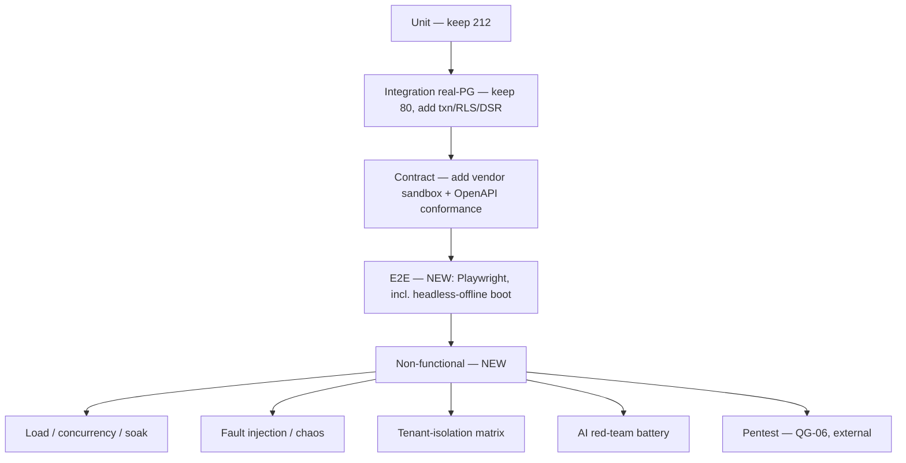

# Test & Resilience Strategy

_Deep architecture audit, 2026-08-09. Verified against `tests/` (332 files, ~4,879 cases) and CI._

## What exists today (verified — genuinely strong for a pre-pilot)
| Layer | Files | Verdict |
|---|---|---|
| Unit | 212 | Deep engine coverage (pure, deterministic) |
| Integration | 80 | Simulator + **real-PostgreSQL** (`skipIf(!DATABASE_URL)`); drive the real router/RBAC/ledger |
| Guardrails | 31 | Executable safety spec — each Hard Rule a CI tripwire, each with a proven tripwire |
| Contract | 2 | API-surface conformance + event/webhook envelope |
| Security | 3 | 240-combo permission matrix, separation-of-duties (incl. "AI never the 2nd person"), data-protection/PII |
| Performance | 3 | **Complexity budgets** (constant-time at 200 vs 20,000 sales; backlog drain) — NOT load/concurrency |
| Migration | 1 | Real-DB migrate-idempotency + trigger enforcement |
| DR (in CI) | — | backup → **DROP DATABASE** → restore → **reconcile to the paisa** every run |
| **E2E / browser** | **0** | `tests/e2e/` is empty — the dominant gap |

**Strengths to preserve:** the guardrail pattern (living safety spec), DR-in-CI, real-Postgres integration, the
240-combination permission sweep, and the "prove the detector fires" tripwire discipline. These are rare and
should be the model for the new suites below.

## The verified gaps (what "green" does not yet prove)
1. **No e2e/browser tests** — no rendered screen, tap-target, offline-boot, or screen-reader verification.
   Chromium + Playwright are available in this environment and unused.
2. **No load / stress / concurrency tests** — perf is algorithmic complexity only; the single shared `pg.Client`
   (GAP-DATA-09) is untested under concurrency.
3. **No fault injection / chaos** — cloud-drop mid-sync, DB failover, disk-full, clock-skew, poison-message
   floods are reasoned-about but not injected.
4. **No dedicated tenant-isolation matrix** — cross-tenant leakage is checked incidentally, not as a systematic
   sweep like the permission matrix.
5. **Thin AI red-team** — one prompt-injection integration case; no standing jailbreak/data-exfil battery; no
   live-model adversarial pass (impossible until a provider is chosen).
6. **No third-party/vendor contract tests** — contract tests validate internal shape, not real vendor fidelity.
7. **No production smoke tests** — no deployed environment to smoke.

## Target test pyramid (build order mirrors the roadmap gates)

## New suites to build (with the gate each unblocks)
| ID | Suite | Proves | Gate |
|---|---|---|---|
| TEST-01 (P0) | **Offline numbering integration** | two lanes offline a day → no duplicate receipt numbers | QG-04 |
| TEST-02 (P1) | **Playwright e2e incl. headless-offline boot** | screens actually render + open with the network cut | the one thing guardrails admit they cannot prove |
| TEST-03 (P1) | **Tenant-isolation matrix** | no cross-tenant read/write across every API × role | GAP-DATA-02 defense-in-depth proof |
| TEST-04 (P1) | **Transaction / partial-failure tests** | multi-event command is atomic; crash mid-command leaves no partial set | GAP-DATA-01 |
| TEST-05 (P1) | **Load / concurrency / soak** | throughput + tail latency at target volume with pool; no lock storms | GAP-DATA-09, scalability |
| TEST-06 (P1) | **Fault injection / chaos** | cloud-drop mid-sync, DB failover, disk-full safe-stop, clock-skew detection, poison-message flood | resilience |
| TEST-07 (P1) | **AI red-team battery** | jailbreak/data-exfil/prompt-injection corpus can never obtain a forbidden tool or commit | GAP-AI-01, OWASP LLM01 |
| TEST-08 (P1) | **Vendor sandbox contract tests** | real PSP/Tally/messaging sandbox round-trips + reconciliation | GAP-INT-01 |
| TEST-09 (P1) | **a11y (axe) sweep + low-spec device** | WCAG 2.2 AA across all screens on a low-spec Android | GAP a11y |
| TEST-10 (P2) | **Production smoke + synthetic monitors** | post-deploy readiness + four-golden-signal alerts fire | GAP-OPS-02 |
| TEST-11 (P2) | **External penetration test** | zero critical/high | QG-06 |

## Resilience proof matrix (Phase-4 scenarios → test that must exist)
| Scenario | Current behaviour (verified) | Test to prove the control | Residual risk until built |
|---|---|---|---|
| Internet down all day | Keeps trading, syncs later | offline-sync-slice (exists) + TEST-02 | inbound freshness (SYNC-01) |
| Cloud down, store trades | Edge is system of record | exists | non-sale dead-letters need operator UI |
| Edge box/disk fails | Money safe if disk survived | restore + replay test (add) | single-box SPOF |
| Sync stops midway | Contiguous-prefix cursor | offline-sync-slice (exists) | — |
| Duplicate transaction | Cloud dedup | the-shop-reaches-the-cloud (exists) | — |
| Edge+cloud edit same record | Dead-letter with reason | TEST-06 + SYNC-03 | conflict UI |
| Out-of-order arrival | Arrival-seq, keeps occurredAt | add ordering test | no causal reorder |
| Device clock wrong | Local clock; may mislabel day | TEST-06 (skew detection) | no NTP |
| Migration while old edge live | Dead-letter unknown types | add compat test | no version negotiation |
| 3rd-party slow/unavailable | Manual fallback, posUnaffected | TEST-08 | no live proof |
| Credentials compromised | RBAC + audit; no revocation | TEST-03 + SEC-04 | token revocation |
| Cross-tenant access attempt | Egress 500 backstop | **TEST-03 (build)** | no RLS |
| Privileged user abuse | maker-checker + audit | separation-of-duties (exists) | support-expiry at API |
| Backup exists, restore fails | restore refuses unless reconciled | QG-08 (exists) | encryption unexercised |
| AI wrong recommendation | Human commits; evidence required | ai-proposes-people-decide (exists) | live-model untested |
| AI unauthorized tool action | Gateway drops ungranted tool | kill-switch guardrail (exists) + TEST-07 | no standing red-team |
| Prompt injection via upload/message | Fenced, dropped | TEST-07 | detection advisory |
| Notification delivery fails | Queue + suppression | notifications tests (exist) | no live channel |
| Hardware corrupt/repeated data | Device certification + idempotency | TEST-08 | no live device |
| Branch reconnects after long offline | Drains in order, dedup | offline-sync-slice (exists) | numbering (SYNC-02) |
| Partial production release | Container refuse/drain in CI | deploy job (exists) | no CD/rollback (OPS-01) |

## CI policy changes (immediate)
- Make **`integration` and `deploy` jobs required** merge checks (today only `verify` is) — GAP-OPS-05.
- Run **`test:perf`** in CI (defined but not run) as a non-blocking trend, then a gate once budgets stabilise.
- Add e2e (TEST-02) and the isolation matrix (TEST-03) to the required set before pilot.
